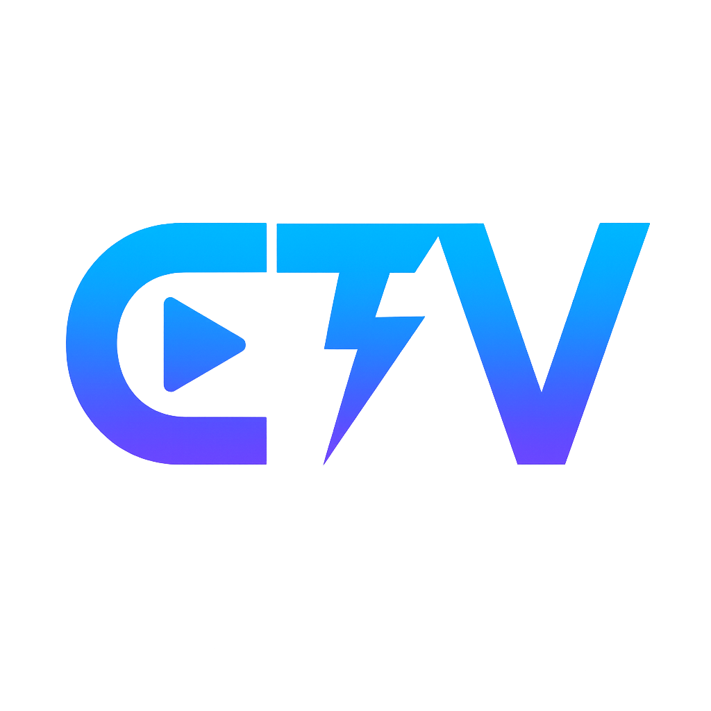

# ClutchTV

**Automatic recording + post-game analysis for League of Legends**

[Download](../../releases/latest) • [Discord](https://discord.gg/9JQzXfTVXE)

---

## What it does

Records your League games automatically with a circular buffer (never fills your disk). After each game, analyzes your performance using Riot's API and tells you what went wrong.

**Main features:**
- 🔄 Auto-recording that deletes old footage to save space
- ✂️ Creates clips for every kill, death, objective
- 🧠 Post-game insights on your deaths, vision, early game mistakes
- 🔒 Everything is local - no cloud, no tracking

## Download

[Latest release](../../releases/latest) - Extract, run ClutchTV.exe, play League.

**You need:**
- Windows 10/11
- ~10-20GB free space
- League in Windowed or Borderless mode (fullscreen doesn't work)

## How insights work

After each game, ClutchTV fetches the match data from Riot's API and analyzes:

**Deaths:** Each death is analyzed for context - were you overextended? Did you die before an objective? Gold disadvantage created?

**Early game:** Deaths before 10min get role-specific analysis:
- Laners: CS loss, wave missed
- Jungle: camps stolen, tempo loss
- Support: ADC left alone

**Vision:** Checks if you placed wards before objectives (Drake/Baron/Herald). Compares your vision score to your role.

Insights link directly to the clip so you can watch what happened.

## ⚠️ Known issues (alpha)

- Windows SmartScreen will complain. Click "More info" → "Run anyway"
- Might need admin rights
- Practice Tool not supported
- Takes 1-2min after game ends for Riot API to index the match

## How it works technically

**Recording:** Uses Windows Graphics Capture API to record at ~100 FPS. Encodes with Media Foundation (H.264). Circular buffer keeps last N hours of footage and auto-deletes old files.

**Events:** Connects to League's Live Client API (port 2999) to track kills/deaths/objectives with coordinates.

**Analysis:** After game, finds the match on Riot's API by timestamp. Fetches match + timeline data. Analyzes deaths, vision score, early game mistakes. Generates insights with actionable suggestions.

**Clips:** FFmpeg extracts 30s clips around each event. Auto-clips saved with thumbnails.

## Files location

- **Videos**: Folder you choose on first launch
- **Database**: `%USERPROFILE%\AppData\Local\ClutchTV\clutchtv.db`
- **Logs**: `%USERPROFILE%\AppData\Local\ClutchTV\logs\`

## Roadmap

Next version:
- Death heatmaps on minimap
- CS/min tracking with overextension warnings
- Multi-game stats dashboard

Long term:
- Microsoft Store (no more SmartScreen)
- More games (Valorant, CS2)
- Clip sharing

## Privacy

No telemetry, no cloud, no account. Everything stays on your PC.

## Bugs?

[Discord](https://discord.gg/9JQzXfTVXE) or [open an issue](../../issues)

---

Made by Processor • 2025
